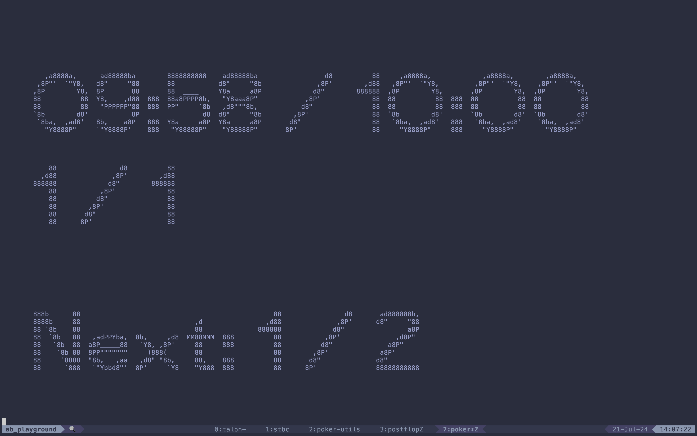

# Poker tournament blinds

`python poker.py --speech-command=say`

- Shows the time and blinds
- Speaks when the blinds (are about to) change
    - Mac: Use the `say` speech-command
    - Mac: Use the `spd-say` speech-command
- Edit constants to configure

